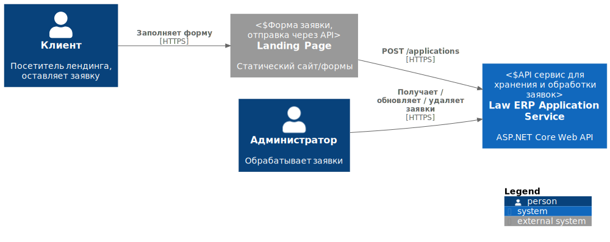
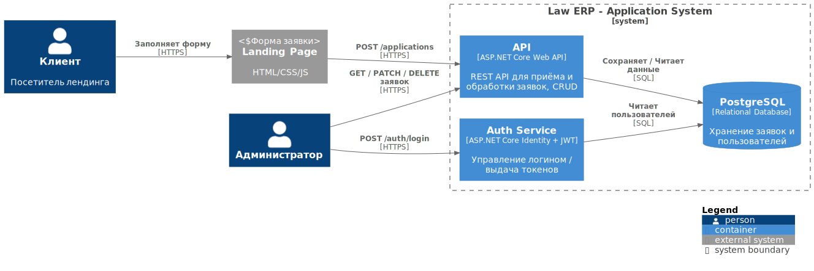

## 1. Цель
Документ описывает архитектуру сервиса на основе C4 (Context + Container), а также выбор технологий.

## 2. Стек технологий
- Backend: ASP.NET Core Web API 9.0
- ORM: Entity Framework Core
- БД: PostgreSQL
- Аутентификация: JWT (ASP.NET Identity)
- Документирование: Swashbuckle / Swagger
- Докеры: Docker + Docker Compose

## 3. Диаграмма: System Context

## 4. Диаграмма: Container

## 5. Компоненты API Container
- Controller: ApplicationsController, AuthController
- Services: ApplicationService (CRUD), AuthService (JWT)
- Data: ApplicationRepository (EF Core)
- Logging: Serilog / built-in logging

## 6. Примечания
Расширения:
 - обновление токена
 - оповещение о новой заявке
